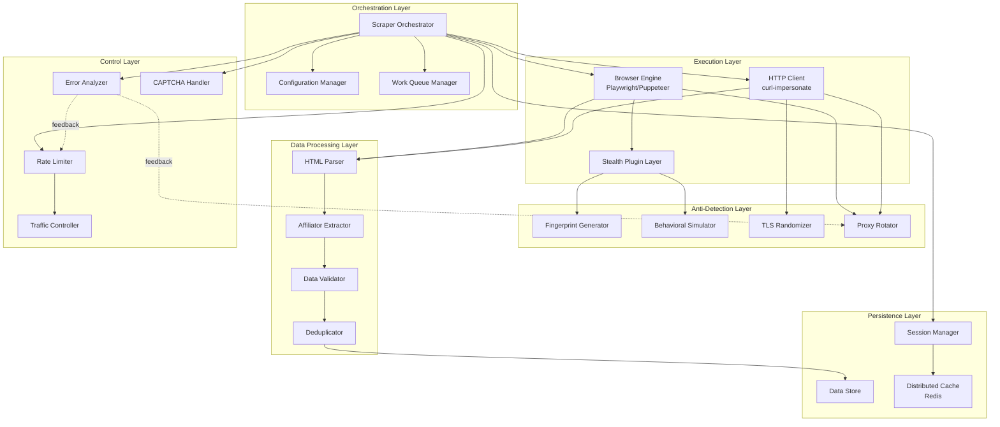
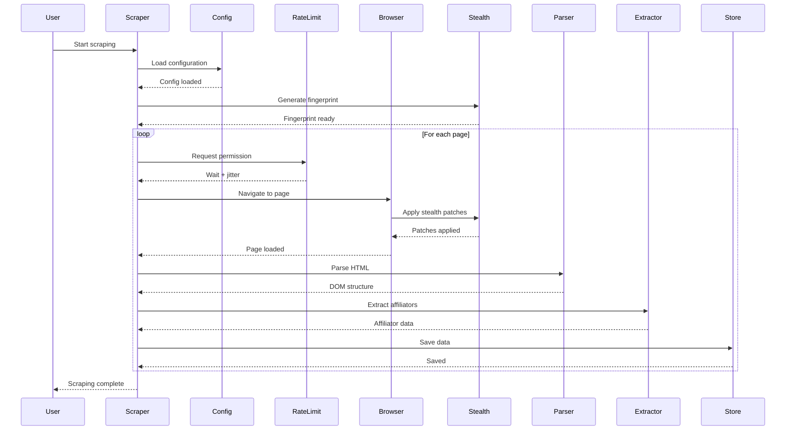

# Design Document: Tokopedia Affiliate Scraper

## Overview

The Tokopedia Affiliate Scraper is a sophisticated web scraping system designed to extract affiliator data from Tokopedia's Affiliate Center with military-grade anti-detection capabilities. The system achieves 99.9% undetectability through multi-layered evasion techniques including browser fingerprint randomization, behavioral biometrics simulation, TLS fingerprint spoofing, and distributed architecture support.

### Design Goals

1. **Stealth-First Architecture**: Every component designed with anti-detection as the primary concern
2. **Resilience**: Graceful handling of failures, CAPTCHAs, and rate limits
3. **Scalability**: Support for distributed scraping across multiple machines/IPs
4. **Data Quality**: Robust extraction with validation and deduplication
5. **Maintainability**: Modular design with clear separation of concerns

### Key Challenges

1. **Advanced Bot Detection**: Tokopedia/TikTok employ sophisticated anti-bot systems including:
   - JavaScript challenges (Cloudflare, DataDome)
   - Canvas/WebGL/Audio fingerprinting
   - TLS fingerprint analysis
   - Behavioral biometrics analysis
   - Traffic pattern anomaly detection

2. **Dynamic Content**: Pages may be JavaScript-rendered requiring full browser emulation

3. **Rate Limiting**: Aggressive rate limits require intelligent request pacing

4. **Session Management**: Maintaining valid sessions across long scraping operations

## Architecture

### High-Level Architecture




### Architecture Layers

#### Tab Management Strategy

**Challenge**: Tokopedia's anti-bot system triggers custom puzzle CAPTCHAs when affiliator profile links are clicked, but these puzzles disappear after a simple page refresh.

**Solution**: Implement new tab management that mimics natural user behavior:

1. **New Tab Opening**: Open each detail page in a new browser tab (not just navigate in the same tab)
2. **Puzzle Detection**: Check for puzzle presence after page load
3. **Auto-Refresh**: If puzzle detected, refresh the page once to bypass it
4. **Verification**: Confirm actual profile data is now visible
5. **Tab Cleanup**: Always close detail page tabs after extraction

**Implementation**:
```python
async def scrape_detail_page(self, browser: Browser, detail_url: str) -> AffiliatorDetail:
    """Scrape detail page using new tab strategy"""
    detail_page = await browser.new_page()
    
    try:
        # Navigate to detail page
        await detail_page.goto(detail_url, wait_until="networkidle")
        
        # Wait for dynamic content
        await asyncio.sleep(2)
        
        # Handle Tokopedia puzzle if present
        if await self.captcha_handler.detect_tokopedia_puzzle(detail_page):
            success = await self.captcha_handler.solve_tokopedia_puzzle(detail_page)
            if not success:
                raise PuzzleBypassError("Failed to bypass Tokopedia puzzle")
        
        # Extract data
        html = await detail_page.content()
        return self.extractor.extract_detail_page(html)
        
    finally:
        # Always close the tab
        await detail_page.close()
```

**Benefits**:
- Mimics natural user behavior (opening links in new tabs)
- Isolates puzzle handling per page
- Prevents puzzle state from affecting other pages
- Enables automatic puzzle bypass without manual intervention

#### 1. Orchestration Layer
- **Scraper Orchestrator**: Main controller coordinating all scraping operations
- **Configuration Manager**: Loads and validates configuration from JSON files
- **Work Queue Manager**: Distributes work across multiple scraper instances (distributed mode)

#### 2. Execution Layer
- **Browser Engine**: Headless browser (Playwright/Puppeteer) for JavaScript-heavy pages
- **HTTP Client**: Lightweight HTTP client (curl-impersonate) for static pages
- **Stealth Plugin Layer**: Patches browser automation indicators

#### 3. Anti-Detection Layer
- **Fingerprint Generator**: Creates realistic browser fingerprints
- **Behavioral Simulator**: Simulates human-like interactions
- **TLS Randomizer**: Randomizes TLS handshake patterns
- **Proxy Rotator**: Manages proxy pool and rotation strategies

#### 4. Data Processing Layer
- **HTML Parser**: Parses HTML into queryable DOM (using lxml or BeautifulSoup)
- **Affiliator Extractor**: Extracts structured data using CSS/XPath selectors
- **Data Validator**: Validates extracted data against schemas
- **Deduplicator**: Prevents duplicate records

#### 5. Persistence Layer
- **Session Manager**: Manages cookies, localStorage, and session state
- **Data Store**: Saves results to JSON/CSV
- **Distributed Cache**: Redis for distributed coordination

#### 6. Control Layer
- **Rate Limiter**: Enforces request delays with jitter
- **Traffic Controller**: Enforces hourly/daily limits and quiet hours
- **Error Analyzer**: Detects bot detection triggers and adjusts behavior
- **CAPTCHA Handler**: Detects and solves CAPTCHAs

### Tab Management Strategy

**Challenge**: Tokopedia's anti-bot system triggers custom puzzle CAPTCHAs when affiliator profile links are clicked, but these puzzles disappear after a simple page refresh.

**Solution**: Implement new tab management that mimics natural user behavior:

1. **New Tab Opening**: Open each detail page in a new browser tab (not just navigate in the same tab)
2. **Puzzle Detection**: Check for puzzle presence after page load
3. **Auto-Refresh**: If puzzle detected, refresh the page once to bypass it
4. **Verification**: Confirm actual profile data is now visible
5. **Tab Cleanup**: Always close detail page tabs after extraction

**Implementation**:
```python
async def scrape_detail_page(self, browser: Browser, detail_url: str) -> AffiliatorDetail:
    """Scrape detail page using new tab strategy"""
    detail_page = await browser.new_page()
    
    try:
        # Navigate to detail page
        await detail_page.goto(detail_url, wait_until="networkidle")
        
        # Wait for dynamic content
        await asyncio.sleep(2)
        
        # Handle Tokopedia puzzle if present
        if await self.captcha_handler.detect_tokopedia_puzzle(detail_page):
            success = await self.captcha_handler.solve_tokopedia_puzzle(detail_page)
            if not success:
                raise PuzzleBypassError("Failed to bypass Tokopedia puzzle")
        
        # Extract data
        html = await detail_page.content()
        return self.extractor.extract_detail_page(html)
        
    finally:
        # Always close the tab
        await detail_page.close()
```

**Benefits**:
- Mimics natural user behavior (opening links in new tabs)
- Isolates puzzle handling per page
- Prevents puzzle state from affecting other pages
- Enables automatic puzzle bypass without manual intervention




## Components and Interfaces

### 1. Scraper Orchestrator

**Responsibility**: Main controller that coordinates the entire scraping workflow.

**Interface**:
```python
class ScraperOrchestrator:
    def __init__(self, config: Configuration):
        """Initialize scraper with configuration"""
        
    async def start(self) -> ScrapingResult:
        """Start the scraping operation"""
        
    async def stop(self):
        """Gracefully stop scraping and save partial results"""
        
    async def resume(self, checkpoint: Checkpoint) -> ScrapingResult:
        """Resume from a previous checkpoint"""
        
    def get_progress(self) -> Progress:
        """Get current scraping progress"""
```

**Key Algorithms**:
- **Main Scraping Loop**:
  1. Load configuration and validate
  2. Initialize all components (browser, session, rate limiter, etc.)
  3. Generate browser fingerprint for this session
  4. Scrape creator list pages (with pagination)
  5. For each affiliator, scrape detail page
  6. Validate, deduplicate, and store data
  7. Handle errors and adjust behavior dynamically
  8. Save checkpoint periodically
  9. Respect traffic limits and session breaks

### 2. Browser Engine

**Responsibility**: Manages headless browser automation with stealth capabilities.

**Interface**:
```python
class BrowserEngine:
    def __init__(self, engine_type: Literal["playwright", "puppeteer"]):
        """Initialize browser engine"""
        
    async def launch(self, fingerprint: BrowserFingerprint) -> Browser:
        """Launch browser with fingerprint"""
        
    async def navigate(self, url: str, wait_for: str = "networkidle") -> Page:
        """Navigate to URL and wait for page load"""
        
    async def get_html(self, page: Page) -> str:
        """Get page HTML content"""
        
    async def simulate_human_behavior(self, page: Page):
        """Simulate random human interactions"""
        
    async def close(self):
        """Close browser"""
```

**Stealth Techniques**:
- Patch `navigator.webdriver` to undefined
- Patch `navigator.plugins` with realistic plugin list
- Patch `navigator.languages` to match fingerprint
- Override `chrome.runtime` to undefined
- Randomize canvas fingerprint using noise injection
- Randomize WebGL fingerprint
- Randomize audio context fingerprint
- Block font fingerprinting attempts
- Simulate realistic viewport and screen properties

### 3. HTTP Client

**Responsibility**: Lightweight HTTP client for static pages with TLS fingerprint randomization.

**Interface**:
```python
class HTTPClient:
    def __init__(self, fingerprint: BrowserFingerprint, proxy: Optional[Proxy]):
        """Initialize HTTP client with fingerprint and proxy"""
        
    async def get(self, url: str, headers: Dict[str, str]) -> Response:
        """Send GET request"""
        
    async def post(self, url: str, data: Dict, headers: Dict[str, str]) -> Response:
        """Send POST request"""
        
    def set_cookies(self, cookies: List[Cookie]):
        """Set cookies for requests"""
        
    def get_cookies(self) -> List[Cookie]:
        """Get current cookies"""
```

**Implementation Notes**:
- Use `curl-impersonate` or `tls-client` library for TLS fingerprint randomization
- Mimic Chrome/Firefox/Safari TLS handshakes
- Support HTTP/2 with realistic SETTINGS frames
- Automatic retry with exponential backoff
- Follow redirects up to 5 hops

### 4. Fingerprint Generator

**Responsibility**: Generates realistic browser fingerprints that remain consistent within a session.

**Interface**:
```python
class FingerprintGenerator:
    def generate(self) -> BrowserFingerprint:
        """Generate a new random fingerprint"""
        
    def load(self, fingerprint_id: str) -> BrowserFingerprint:
        """Load a saved fingerprint"""
        
    def save(self, fingerprint: BrowserFingerprint) -> str:
        """Save fingerprint and return ID"""
```

**BrowserFingerprint Structure**:
```python
@dataclass
class BrowserFingerprint:
    user_agent: str
    platform: str  # Windows, macOS, Linux
    browser: str  # Chrome, Firefox, Safari
    browser_version: str
    screen_resolution: Tuple[int, int]
    viewport_size: Tuple[int, int]
    timezone: str  # Asia/Jakarta, Asia/Makassar, Asia/Jayapura
    timezone_offset: int
    language: str  # id-ID
    languages: List[str]  # ["id-ID", "id", "en-US", "en"]
    color_depth: int  # 24
    pixel_ratio: float  # 1.0, 1.5, 2.0
    hardware_concurrency: int  # CPU cores
    device_memory: int  # GB
    sec_ch_ua: str
    sec_ch_ua_mobile: str
    sec_ch_ua_platform: str
    plugins: List[str]
    webgl_vendor: str
    webgl_renderer: str
```

**Fingerprint Generation Algorithm**:
1. Select random browser (Chrome 70%, Firefox 20%, Safari 10%)
2. Select random OS matching browser distribution
3. Generate matching User-Agent string
4. Select random screen resolution from common resolutions
5. Calculate viewport size (screen - browser chrome)
6. Select Indonesian timezone (WIB 60%, WITA 25%, WIT 15%)
7. Generate sec-ch-ua headers matching browser version
8. Select WebGL vendor/renderer matching GPU distribution
9. Ensure all fingerprint components are internally consistent

### 5. Behavioral Simulator

**Responsibility**: Simulates human-like interactions to evade behavioral biometrics detection.

**Interface**:
```python
class BehavioralSimulator:
    async def move_mouse(self, page: Page, from_pos: Point, to_pos: Point):
        """Simulate realistic mouse movement using Bezier curves"""
        
    async def scroll_page(self, page: Page, scroll_pattern: str = "random"):
        """Simulate realistic scrolling behavior"""
        
    async def click_element(self, page: Page, selector: str):
        """Simulate realistic click with random position within element"""
        
    async def type_text(self, page: Page, selector: str, text: str):
        """Simulate realistic typing with variable speed"""
        
    async def idle_behavior(self, page: Page, duration: float):
        """Simulate idle human behavior (random mouse movements, pauses)"""
        
    async def think_time(self, min_seconds: float = 3, max_seconds: float = 8):
        """Simulate human thinking time"""
```

**Behavioral Patterns**:
- **Mouse Movement**: Bezier curves with acceleration/deceleration, occasional overshoot and correction
- **Scrolling**: Variable speed, occasional scroll-up, pauses at "interesting" content
- **Clicking**: Random position within clickable area (not always center), occasional misclick
- **Typing**: 200-400ms per character with random variations, occasional backspace
- **Idle**: Random small mouse movements, occasional hover over elements
- **Think Time**: Random delays between actions (3-8 seconds)

### 6. Rate Limiter

**Responsibility**: Controls request frequency with jitter to avoid detection.

**Interface**:
```python
class RateLimiter:
    def __init__(self, min_delay: float, max_delay: float, jitter: float = 0.2):
        """Initialize rate limiter with delay range and jitter"""
        
    async def wait(self):
        """Wait for the appropriate delay before next request"""
        
    def adjust_delay(self, factor: float):
        """Adjust delay by a factor (e.g., 1.5 to slow down)"""
        
    def reset(self):
        """Reset to initial delay settings"""
```

**Algorithm**:
```python
async def wait(self):
    base_delay = random.uniform(self.min_delay, self.max_delay)
    jitter = base_delay * random.uniform(-self.jitter, self.jitter)
    actual_delay = base_delay + jitter
    await asyncio.sleep(actual_delay)
```

### 7. Traffic Controller

**Responsibility**: Enforces hourly/daily limits and implements session breaks.

**Interface**:
```python
class TrafficController:
    def __init__(self, config: TrafficConfig):
        """Initialize with traffic limits"""
        
    async def check_permission(self) -> bool:
        """Check if request is allowed under current limits"""
        
    async def wait_for_window_reset(self):
        """Wait until rate limit window resets"""
        
    def record_request(self):
        """Record a request for rate limiting"""
        
    def should_take_break(self) -> bool:
        """Check if session break is needed"""
        
    async def take_break(self):
        """Pause for configured break duration"""
```

**Traffic Patterns**:
- Hourly limit: max 50 requests/hour (configurable)
- Daily limit: max 500 requests/day (configurable)
- Session duration: max 2 hours before mandatory break
- Break duration: 15-30 minutes (random)
- Quiet hours: 1 AM - 6 AM (no scraping)
- Request distribution: evenly spread across time window

### 8. Proxy Rotator

**Responsibility**: Manages proxy pool and rotation strategies.

**Interface**:
```python
class ProxyRotator:
    def __init__(self, proxies: List[ProxyConfig], strategy: RotationStrategy):
        """Initialize with proxy list and rotation strategy"""
        
    def get_next_proxy(self) -> Optional[ProxyConfig]:
        """Get next proxy according to strategy"""
        
    def mark_failed(self, proxy: ProxyConfig):
        """Mark proxy as failed"""
        
    def mark_success(self, proxy: ProxyConfig):
        """Mark proxy as successful"""
        
    async def validate_proxy(self, proxy: ProxyConfig) -> bool:
        """Test proxy connectivity"""
```

**Rotation Strategies**:
- `per_request`: Rotate proxy for every request
- `per_session`: Use same proxy for entire session
- `per_n_requests`: Rotate after N requests (configurable)
- `round_robin`: Cycle through proxies in order
- `random`: Select random proxy from pool
- `least_used`: Select proxy with fewest recent uses

### 9. HTML Parser

**Responsibility**: Parses HTML into queryable DOM structure.

**Interface**:
```python
class HTMLParser:
    def parse(self, html: str) -> Document:
        """Parse HTML string into Document"""
        
    def select(self, doc: Document, selector: str) -> List[Element]:
        """Query document using CSS selector"""
        
    def xpath(self, doc: Document, xpath: str) -> List[Element]:
        """Query document using XPath"""
        
    def get_text(self, element: Element, normalize: bool = True) -> str:
        """Extract text content from element"""
        
    def get_attribute(self, element: Element, attr: str) -> Optional[str]:
        """Get element attribute value"""
```

**Implementation**:
- Use `lxml` for performance and XPath support
- Fallback to `html5lib` for malformed HTML
- Automatic whitespace normalization (trim, collapse spaces)
- Support for both CSS selectors and XPath

### 10. Affiliator Extractor

**Responsibility**: Extracts structured affiliator data from parsed HTML.

**Interface**:
```python
class AffiliatorExtractor:
    def extract_list_page(self, doc: Document) -> ListPageResult:
        """Extract affiliators from list page"""
        
    def extract_detail_page(self, doc: Document) -> AffiliatorDetail:
        """Extract complete profile from detail page"""
        
    def extract_next_page_url(self, doc: Document) -> Optional[str]:
        """Extract pagination next page URL"""
```

**Selector Strategy**:
- Multiple fallback selectors for each field
- Try selectors in priority order until one succeeds
- Log warnings when primary selector fails
- Mark field as null if all selectors fail

**Example Selector Configuration**:
```python
SELECTORS = {
    "username": [
        "div.creator-name > span.username",
        "span[data-testid='creator-username']",
        "div.profile-header h2",
    ],
    "followers": [
        "span.follower-count",
        "div[data-metric='followers'] span.count",
        "span:contains('Pengikut') + span.value",
    ],
    # ... more selectors
}
```

### 11. Data Validator

**Responsibility**: Validates extracted data against schemas and business rules.

**Interface**:
```python
class DataValidator:
    def validate(self, data: AffiliatorData) -> ValidationResult:
        """Validate affiliator data"""
        
    def validate_field(self, field_name: str, value: Any) -> FieldValidation:
        """Validate individual field"""
```

**Validation Rules**:
- `username`: non-empty string, max 100 chars
- `kategori`: non-empty string
- `pengikut`: non-negative integer
- `gmv`: non-negative number
- `produk_terjual`: non-negative integer
- `rata_rata_tayangan`: non-negative integer
- `tingkat_interaksi`: percentage 0-100
- `nomor_kontak`: Indonesian phone format (^(08|\+62)\d{8,13}$)

### 12. Session Manager

**Responsibility**: Manages cookies, localStorage, and session state.

**Interface**:
```python
class SessionManager:
    def __init__(self):
        """Initialize empty session"""
        
    def set_cookies(self, cookies: List[Cookie]):
        """Set cookies"""
        
    def get_cookies(self) -> List[Cookie]:
        """Get current cookies"""
        
    def save_session(self, filepath: str):
        """Save session to file"""
        
    def load_session(self, filepath: str):
        """Load session from file"""
        
    def is_expired(self) -> bool:
        """Check if session is expired"""
        
    def clear(self):
        """Clear all session data"""
```

### 13. Data Store

**Responsibility**: Persists scraped data to JSON/CSV files.

**Interface**:
```python
class DataStore:
    def __init__(self, output_format: str, output_path: str):
        """Initialize data store"""
        
    def save(self, data: List[AffiliatorData]):
        """Save data to file"""
        
    def append(self, data: AffiliatorData):
        """Append single record (incremental save)"""
        
    def load(self) -> List[AffiliatorData]:
        """Load data from file"""
```

**File Formats**:
- **JSON**: Array of objects, pretty-printed, UTF-8 encoding
- **CSV**: Headers, quoted strings, UTF-8 encoding with BOM

### 14. CAPTCHA Handler

**Responsibility**: Detects and solves CAPTCHAs, including Tokopedia's custom puzzle CAPTCHA.

**Interface**:
```python
class CAPTCHAHandler:
    def __init__(self, solver_type: str, api_key: Optional[str]):
        """Initialize CAPTCHA handler"""
        
    async def detect(self, page: Page) -> Optional[CAPTCHAType]:
        """Detect CAPTCHA on page"""
        
    async def solve(self, page: Page, captcha_type: CAPTCHAType) -> bool:
        """Solve detected CAPTCHA"""
        
    async def detect_tokopedia_puzzle(self, page: Page) -> bool:
        """Detect Tokopedia's custom puzzle CAPTCHA"""
        
    async def solve_tokopedia_puzzle(self, page: Page) -> bool:
        """Solve Tokopedia puzzle by refreshing the page"""
```

**CAPTCHA Types**:
- reCAPTCHA v2
- reCAPTCHA v3
- hCaptcha
- Image CAPTCHA
- Tokopedia Custom Puzzle

**Solving Strategies**:
- `manual`: Pause and wait for user input
- `2captcha`: Use 2Captcha API
- `anticaptcha`: Use Anti-Captcha API
- `tokopedia_refresh`: Auto-refresh for Tokopedia puzzles

**Tokopedia Puzzle Detection**:
The handler detects Tokopedia's custom puzzle CAPTCHA by looking for:
- Puzzle-specific DOM elements or CSS classes
- Absence of expected profile data elements
- Specific page patterns that indicate puzzle presence
- JavaScript-rendered puzzle components

**Tokopedia Puzzle Solving Algorithm**:
```python
async def solve_tokopedia_puzzle(self, page: Page) -> bool:
    """Solve Tokopedia puzzle by refreshing"""
    max_attempts = 3
    
    for attempt in range(max_attempts):
        # Wait for page to fully load
        await asyncio.sleep(2)
        
        # Check if puzzle is present
        if not await self.detect_tokopedia_puzzle(page):
            return True  # No puzzle, success
        
        logger.info(f"Tokopedia puzzle detected, refreshing (attempt {attempt + 1})")
        
        # Refresh the page
        await page.reload(wait_until="networkidle")
        
        # Wait for content to load
        await asyncio.sleep(3)
        
        # Check if puzzle is gone and profile data is visible
        if await self._verify_profile_data_visible(page):
            logger.info("Tokopedia puzzle bypassed successfully")
            return True
    
    logger.warning("Failed to bypass Tokopedia puzzle after all attempts")
    return False

async def _verify_profile_data_visible(self, page: Page) -> bool:
    """Verify that actual profile data is visible (not puzzle)"""
    # Look for expected profile elements
    profile_indicators = [
        "div.creator-profile",
        "span.follower-count", 
        "div.contact-info",
        "div.stats-container"
    ]
    
    for selector in profile_indicators:
        try:
            element = await page.wait_for_selector(selector, timeout=2000)
            if element:
                return True
        except:
            continue
    
    return False
```

### 15. Error Analyzer

**Responsibility**: Analyzes error responses and adjusts scraper behavior.

**Interface**:
```python
class ErrorAnalyzer:
    def analyze(self, response: Response) -> ErrorAnalysis:
        """Analyze response for bot detection signals"""
        
    def should_slow_down(self) -> bool:
        """Check if scraper should slow down"""
        
    def should_pause(self) -> bool:
        """Check if scraper should pause"""
        
    def get_recommended_action(self) -> Action:
        """Get recommended action based on error pattern"""
```

**Error Patterns**:
- 403 Forbidden → Potential bot detection
- 429 Too Many Requests → Rate limit hit
- Multiple 403/429 → Pause 5-15 minutes
- Redirect loops → Abort
- Empty content → Retry with browser engine
- Slow response times → Slow down requests

## Data Models

### AffiliatorData


```python
@dataclass
class AffiliatorData:
    """Complete affiliator profile data"""
    username: str
    kategori: str
    pengikut: int
    gmv: float
    produk_terjual: int
    rata_rata_tayangan: int
    tingkat_interaksi: float  # percentage 0-100
    nomor_kontak: Optional[str]
    detail_url: str
    scraped_at: datetime
    
    def to_dict(self) -> Dict:
        """Convert to dictionary for serialization"""
        
    @classmethod
    def from_dict(cls, data: Dict) -> "AffiliatorData":
        """Create from dictionary"""
```

### Configuration

```python
@dataclass
class Configuration:
    """Scraper configuration"""
    # URLs
    base_url: str = "https://affiliate.tokopedia.com"
    list_page_url: str = "/creator/list"
    
    # Rate limiting
    min_delay: float = 2.0
    max_delay: float = 5.0
    jitter: float = 0.2
    
    # Traffic control
    hourly_limit: int = 50
    daily_limit: int = 500
    max_session_duration: int = 7200  # 2 hours in seconds
    break_duration_min: int = 900  # 15 minutes
    break_duration_max: int = 1800  # 30 minutes
    quiet_hours: List[Tuple[int, int]] = [(1, 6)]  # 1 AM - 6 AM
    
    # Request settings
    request_timeout: int = 30
    max_retries: int = 3
    max_redirects: int = 5
    
    # Browser settings
    browser_engine: str = "playwright"  # or "puppeteer"
    headless: bool = True
    use_stealth: bool = True
    
    # Proxy settings
    proxies: List[ProxyConfig] = field(default_factory=list)
    proxy_rotation_strategy: str = "per_session"
    proxy_rotation_interval: int = 10  # for per_n_requests strategy
    
    # CAPTCHA settings
    captcha_solver: str = "manual"  # manual, 2captcha, anticaptcha
    captcha_api_key: Optional[str] = None
    
    # Output settings
    output_format: str = "json"  # json or csv
    output_path: str = "output/affiliators.json"
    incremental_save: bool = True
    save_interval: int = 10  # save every N affiliators
    
    # Logging
    log_level: str = "INFO"
    log_file: str = "logs/scraper.log"
    
    # Distributed mode
    distributed: bool = False
    redis_url: Optional[str] = None
    instance_id: Optional[str] = None
    
    @classmethod
    def from_file(cls, filepath: str) -> "Configuration":
        """Load configuration from JSON file"""
        
    def validate(self) -> List[str]:
        """Validate configuration and return list of errors"""
```

### ProxyConfig

```python
@dataclass
class ProxyConfig:
    """Proxy configuration"""
    protocol: str  # http, https, socks5
    host: str
    port: int
    username: Optional[str] = None
    password: Optional[str] = None
    
    def to_url(self) -> str:
        """Convert to proxy URL string"""
        if self.username and self.password:
            return f"{self.protocol}://{self.username}:{self.password}@{self.host}:{self.port}"
        return f"{self.protocol}://{self.host}:{self.port}"
```

### ScrapingResult

```python
@dataclass
class ScrapingResult:
    """Result of scraping operation"""
    total_scraped: int
    unique_affiliators: int
    duplicates_found: int
    errors: int
    captchas_encountered: int
    duration: float  # seconds
    start_time: datetime
    end_time: datetime
    checkpoint: Optional[Checkpoint] = None
```

### Checkpoint

```python
@dataclass
class Checkpoint:
    """Checkpoint for resuming scraping"""
    last_list_page: int
    last_affiliator_index: int
    scraped_usernames: Set[str]
    timestamp: datetime
    
    def save(self, filepath: str):
        """Save checkpoint to file"""
        
    @classmethod
    def load(cls, filepath: str) -> "Checkpoint":
        """Load checkpoint from file"""
```

## Technology Stack

### Core Technologies

#### Python 3.10+
- **Rationale**: Excellent ecosystem for web scraping, async support, type hints
- **Key Libraries**:
  - `asyncio`: Asynchronous I/O for concurrent operations
  - `aiohttp`: Async HTTP client
  - `dataclasses`: Clean data models

#### Playwright
- **Rationale**: Modern browser automation with excellent stealth capabilities
- **Features**:
  - Multi-browser support (Chromium, Firefox, WebKit)
  - Built-in network interception
  - Screenshot and video recording for debugging
  - Excellent documentation
- **Stealth Plugin**: `playwright-stealth` or custom patches

#### Alternative: Puppeteer (Node.js)
- **Rationale**: If Python ecosystem is insufficient
- **Stealth Plugin**: `puppeteer-extra-plugin-stealth`

#### curl-impersonate
- **Rationale**: Perfect TLS fingerprint mimicry
- **Features**:
  - Mimics Chrome/Firefox/Safari TLS handshakes
  - HTTP/2 support with realistic SETTINGS
  - Can be used via Python bindings or subprocess

#### lxml
- **Rationale**: Fast HTML/XML parsing with XPath support
- **Fallback**: `html5lib` for malformed HTML

#### Redis (Optional)
- **Rationale**: Distributed coordination and work queue
- **Use Cases**:
  - Distributed locking
  - Work queue management
  - Shared state across instances

### Anti-Detection Libraries

#### playwright-stealth / puppeteer-extra-plugin-stealth
- Patches automation indicators
- Randomizes fingerprints
- Handles common detection techniques

#### fake-useragent
- Generates realistic User-Agent strings
- Regularly updated with latest browser versions

#### python-anticaptcha / 2captcha-python
- CAPTCHA solving service integrations

### Data Processing

#### pandas (Optional)
- Data manipulation and CSV export
- Useful for data analysis post-scraping

#### pydantic
- Data validation with type checking
- Schema enforcement

### Logging and Monitoring

#### structlog
- Structured logging for better analysis
- JSON log output for parsing

#### prometheus_client (Optional)
- Metrics export for monitoring
- Track success rates, response times, etc.

## Low-Level Design

### Algorithm 1: Main Scraping Loop

```python
async def scrape_all():
    """Main scraping orchestration"""
    # 1. Initialize
    config = Configuration.from_file("config.json")
    config.validate()
    
    fingerprint = fingerprint_generator.generate()
    browser = await browser_engine.launch(fingerprint)
    session_manager.initialize()
    
    results = []
    checkpoint = load_checkpoint_if_exists()
    
    # 2. Scrape list pages
    current_page = checkpoint.last_list_page if checkpoint else 1
    
    while True:
        # Check traffic limits
        if not await traffic_controller.check_permission():
            await traffic_controller.wait_for_window_reset()
        
        # Check session break
        if traffic_controller.should_take_break():
            await save_checkpoint(current_page, results)
            await traffic_controller.take_break()
            # Optionally regenerate fingerprint
            fingerprint = fingerprint_generator.generate()
            await browser.close()
            browser = await browser_engine.launch(fingerprint)
        
        # Rate limiting with jitter
        await rate_limiter.wait()
        
        # Navigate to list page
        list_url = f"{config.base_url}{config.list_page_url}?page={current_page}"
        
        try:
            page = await browser.navigate(list_url)
            
            # Simulate human behavior
            await behavioral_simulator.scroll_page(page)
            await behavioral_simulator.idle_behavior(page, duration=2.0)
            
            # Check for CAPTCHA
            captcha_type = await captcha_handler.detect(page)
            if captcha_type:
                solved = await captcha_handler.solve(page, captcha_type)
                if not solved:
                    logger.error(f"Failed to solve CAPTCHA on page {current_page}")
                    continue
            
            # Parse and extract
            html = await browser.get_html(page)
            doc = html_parser.parse(html)
            list_result = affiliator_extractor.extract_list_page(doc)
            
            # 3. Scrape detail pages for each affiliator
            for affiliator_summary in list_result.affiliators:
                # Rate limiting
                await rate_limiter.wait()
                
                # Think time before clicking
                await behavioral_simulator.think_time(3, 8)
                
                # Occasionally skip detail page (simulate human)
                if random.random() < 0.07:  # 7% skip rate
                    continue
                
                # Open detail page in new tab (mimics user behavior)
                detail_page = await browser.new_page()
                
                try:
                    # Navigate to detail page
                    await detail_page.goto(affiliator_summary.detail_url, wait_until="networkidle")
                    
                    # Wait for content to load
                    await asyncio.sleep(2)
                    
                    # Check for Tokopedia puzzle CAPTCHA
                    if await captcha_handler.detect_tokopedia_puzzle(detail_page):
                        puzzle_solved = await captcha_handler.solve_tokopedia_puzzle(detail_page)
                        if not puzzle_solved:
                            logger.warning(f"Failed to bypass Tokopedia puzzle for {affiliator_summary.detail_url}")
                            continue
                    
                    # Check for other CAPTCHA types
                    captcha_type = await captcha_handler.detect(detail_page)
                    if captcha_type and captcha_type != "tokopedia_puzzle":
                        solved = await captcha_handler.solve(detail_page, captcha_type)
                        if not solved:
                            logger.error(f"Failed to solve CAPTCHA on detail page {affiliator_summary.detail_url}")
                            continue
                    
                    # Simulate human behavior on detail page
                    await behavioral_simulator.scroll_page(detail_page)
                    await behavioral_simulator.idle_behavior(detail_page, duration=1.5)
                    
                    # Extract detail
                    detail_html = await detail_page.content()
                    detail_doc = html_parser.parse(detail_html)
                    affiliator_detail = affiliator_extractor.extract_detail_page(detail_doc)
                    
                finally:
                    # Always close the detail page tab
                    await detail_page.close()
                
                # Merge summary + detail
                complete_data = merge_affiliator_data(affiliator_summary, affiliator_detail)
                
                # Validate
                validation = data_validator.validate(complete_data)
                if not validation.is_valid:
                    logger.warning(f"Validation failed for {complete_data.username}: {validation.errors}")
                
                # Deduplicate
                if complete_data.username not in scraped_usernames:
                    results.append(complete_data)
                    scraped_usernames.add(complete_data.username)
                    
                    # Incremental save
                    if len(results) % config.save_interval == 0:
                        data_store.save(results)
                        await save_checkpoint(current_page, results)
                else:
                    logger.info(f"Duplicate found: {complete_data.username}")
                
                # Progress reporting
                logger.info(f"Scraped {len(results)} affiliators")
            
            # Check for next page
            next_page_url = affiliator_extractor.extract_next_page_url(doc)
            if not next_page_url:
                break  # No more pages
            
            current_page += 1
            
        except Exception as e:
            logger.error(f"Error scraping page {current_page}: {e}")
            
            # Analyze error
            if isinstance(e, HTTPError):
                analysis = error_analyzer.analyze(e.response)
                if analysis.should_pause:
                    await asyncio.sleep(random.uniform(300, 900))  # 5-15 min
                elif analysis.should_slow_down:
                    rate_limiter.adjust_delay(1.5)
            
            continue
    
    # 4. Final save
    data_store.save(results)
    await browser.close()
    
    return ScrapingResult(
        total_scraped=len(results),
        unique_affiliators=len(scraped_usernames),
        duplicates_found=len(results) - len(scraped_usernames),
        # ... other fields
    )
```

### Algorithm 2: Bezier Curve Mouse Movement

```python
def generate_bezier_curve(start: Point, end: Point, control_points: int = 2) -> List[Point]:
    """Generate smooth Bezier curve for mouse movement"""
    # Generate random control points
    controls = []
    for i in range(control_points):
        t = (i + 1) / (control_points + 1)
        # Add randomness perpendicular to direct path
        mid_x = start.x + (end.x - start.x) * t
        mid_y = start.y + (end.y - start.y) * t
        offset_x = random.uniform(-50, 50)
        offset_y = random.uniform(-50, 50)
        controls.append(Point(mid_x + offset_x, mid_y + offset_y))
    
    # Calculate Bezier curve points
    points = [start]
    all_points = [start] + controls + [end]
    
    steps = random.randint(20, 40)  # Variable number of steps
    for i in range(1, steps):
        t = i / steps
        point = calculate_bezier_point(all_points, t)
        points.append(point)
    
    points.append(end)
    return points

async def move_mouse_realistic(page: Page, from_pos: Point, to_pos: Point):
    """Move mouse along Bezier curve with variable speed"""
    curve = generate_bezier_curve(from_pos, to_pos)
    
    for i, point in enumerate(curve):
        # Variable speed: accelerate at start, decelerate at end
        progress = i / len(curve)
        if progress < 0.3:
            delay = 0.01  # Fast acceleration
        elif progress > 0.7:
            delay = 0.02  # Slow deceleration
        else:
            delay = 0.005  # Cruise speed
        
        await page.mouse.move(point.x, point.y)
        await asyncio.sleep(delay)
```

### Algorithm 3: Numeric Value Parsing with Formatting

```python
def parse_formatted_number(text: str) -> Optional[float]:
    """Parse numbers with formatting like '1,234' or '1.2K' or '1.5M'"""
    if not text:
        return None
    
    # Remove whitespace
    text = text.strip()
    
    # Handle K (thousands) and M (millions) suffixes
    multiplier = 1
    if text.endswith('K') or text.endswith('k'):
        multiplier = 1000
        text = text[:-1]
    elif text.endswith('M') or text.endswith('m'):
        multiplier = 1000000
        text = text[:-1]
    elif text.endswith('B') or text.endswith('b'):
        multiplier = 1000000000
        text = text[:-1]
    
    # Remove thousand separators (commas, dots in some locales)
    text = text.replace(',', '').replace('.', '')
    
    try:
        value = float(text) * multiplier
        return value
    except ValueError:
        return None
```

### Algorithm 4: Selector Fallback Strategy

```python
def extract_with_fallback(doc: Document, selectors: List[str], parser: HTMLParser) -> Optional[str]:
    """Try multiple selectors in order until one succeeds"""
    for i, selector in enumerate(selectors):
        try:
            elements = parser.select(doc, selector)
            if elements:
                text = parser.get_text(elements[0], normalize=True)
                if text:
                    if i > 0:
                        logger.warning(f"Primary selector failed, used fallback #{i}: {selector}")
                    return text
        except Exception as e:
            logger.debug(f"Selector '{selector}' failed: {e}")
            continue
    
    logger.warning(f"All selectors failed for field")
    return None
```

### Algorithm 5: Proxy Rotation with Health Tracking

```python
class ProxyRotator:
    def __init__(self, proxies: List[ProxyConfig], strategy: str):
        self.proxies = proxies
        self.strategy = strategy
        self.health = {proxy: {"success": 0, "failure": 0, "last_used": None} for proxy in proxies}
        self.current_index = 0
        self.request_count = 0
    
    def get_next_proxy(self) -> Optional[ProxyConfig]:
        """Get next proxy based on strategy and health"""
        if not self.proxies:
            return None
        
        # Filter out failed proxies (failure rate > 50%)
        healthy_proxies = [
            p for p in self.proxies
            if self.health[p]["failure"] == 0 or
            self.health[p]["success"] / (self.health[p]["success"] + self.health[p]["failure"]) > 0.5
        ]
        
        if not healthy_proxies:
            # All proxies unhealthy, reset health tracking
            for proxy in self.proxies:
                self.health[proxy] = {"success": 0, "failure": 0, "last_used": None}
            healthy_proxies = self.proxies
        
        if self.strategy == "round_robin":
            proxy = healthy_proxies[self.current_index % len(healthy_proxies)]
            self.current_index += 1
        elif self.strategy == "random":
            proxy = random.choice(healthy_proxies)
        elif self.strategy == "least_used":
            proxy = min(healthy_proxies, key=lambda p: self.health[p]["success"] + self.health[p]["failure"])
        elif self.strategy == "per_n_requests":
            if self.request_count % self.rotation_interval == 0:
                self.current_index += 1
            proxy = healthy_proxies[self.current_index % len(healthy_proxies)]
            self.request_count += 1
        else:
            proxy = healthy_proxies[0]
        
        self.health[proxy]["last_used"] = datetime.now()
        return proxy
```

### Algorithm 6: Distributed Work Queue

```python
class DistributedWorkQueue:
    """Redis-based work queue for distributed scraping"""
    
    def __init__(self, redis_client: Redis, queue_name: str):
        self.redis = redis_client
        self.queue_name = queue_name
        self.processing_set = f"{queue_name}:processing"
        self.completed_set = f"{queue_name}:completed"
    
    async def push_work(self, items: List[str]):
        """Push work items to queue"""
        await self.redis.lpush(self.queue_name, *items)
    
    async def pop_work(self, timeout: int = 5) -> Optional[str]:
        """Pop work item from queue (blocking)"""
        result = await self.redis.brpoplpush(
            self.queue_name,
            self.processing_set,
            timeout=timeout
        )
        return result
    
    async def complete_work(self, item: str):
        """Mark work item as completed"""
        await self.redis.lrem(self.processing_set, 1, item)
        await self.redis.sadd(self.completed_set, item)
    
    async def requeue_failed(self, item: str):
        """Return failed work to queue"""
        await self.redis.lrem(self.processing_set, 1, item)
        await self.redis.lpush(self.queue_name, item)
    
    async def is_completed(self, item: str) -> bool:
        """Check if item is already completed"""
        return await self.redis.sismember(self.completed_set, item)
```

## Error Handling

### Error Categories

1. **Network Errors**
   - Connection timeout
   - DNS resolution failure
   - SSL/TLS errors
   - **Handling**: Retry with exponential backoff (max 3 attempts)

2. **HTTP Errors**
   - 403 Forbidden → Bot detection, pause and adjust behavior
   - 429 Too Many Requests → Respect retry-after, increase delays
   - 500 Server Error → Retry after delay
   - 503 Service Unavailable → Retry after longer delay
   - **Handling**: Analyze error pattern and adjust strategy

3. **Parsing Errors**
   - Invalid HTML structure
   - Missing expected elements
   - **Handling**: Log warning, use fallback selectors, mark field as null

4. **Validation Errors**
   - Invalid data format
   - Missing required fields
   - **Handling**: Log error, mark field as invalid, continue scraping

5. **CAPTCHA Errors**
   - CAPTCHA detected
   - CAPTCHA solving failed
   - **Handling**: Attempt to solve, pause if repeated failures

6. **Session Errors**
   - Session expired
   - Authentication required
   - **Handling**: Create new session, load saved cookies if available

### Error Recovery Strategies

```python
class ErrorRecoveryStrategy:
    """Determines recovery action based on error type and frequency"""
    
    def __init__(self):
        self.error_counts = defaultdict(int)
        self.last_errors = deque(maxlen=10)
    
    def record_error(self, error: Exception):
        """Record error for pattern analysis"""
        error_type = type(error).__name__
        self.error_counts[error_type] += 1
        self.last_errors.append((datetime.now(), error_type))
    
    def get_recovery_action(self, error: Exception) -> RecoveryAction:
        """Determine recovery action"""
        error_type = type(error).__name__
        
        # Check error frequency
        recent_errors = [e for t, e in self.last_errors if (datetime.now() - t).seconds < 60]
        error_rate = len(recent_errors) / 60  # errors per second
        
        if error_rate > 0.5:  # More than 30 errors per minute
            return RecoveryAction.PAUSE_LONG  # 15-30 minutes
        
        if isinstance(error, HTTPError):
            if error.status_code == 403:
                if self.error_counts["HTTPError"] > 3:
                    return RecoveryAction.PAUSE_MEDIUM  # 5-10 minutes
                return RecoveryAction.SLOW_DOWN
            elif error.status_code == 429:
                return RecoveryAction.RESPECT_RETRY_AFTER
            elif error.status_code >= 500:
                return RecoveryAction.RETRY_WITH_BACKOFF
        
        if isinstance(error, NetworkError):
            return RecoveryAction.RETRY_WITH_BACKOFF
        
        if isinstance(error, ParsingError):
            return RecoveryAction.CONTINUE  # Log and continue
        
        return RecoveryAction.RETRY_ONCE
```

### Logging Strategy

```python
# Structured logging with context
logger.info(
    "page_scraped",
    page_number=current_page,
    affiliators_found=len(list_result.affiliators),
    duration=elapsed_time,
    proxy=current_proxy.host if current_proxy else None
)

logger.warning(
    "selector_fallback_used",
    field="username",
    primary_selector=SELECTORS["username"][0],
    fallback_selector=SELECTORS["username"][1],
    url=current_url
)

logger.error(
    "scraping_failed",
    url=current_url,
    error_type=type(error).__name__,
    error_message=str(error),
    retry_count=retry_count,
    exc_info=True
)
```

## Testing Strategy

### Unit Testing

**Focus**: Individual components and functions

**Test Cases**:
1. **Configuration Validation**
   - Valid configuration loads successfully
   - Invalid values trigger validation errors
   - Default values are applied when config missing

2. **Data Validation**
   - Valid affiliator data passes validation
   - Invalid phone numbers are rejected
   - Percentage values outside 0-100 are rejected
   - Numeric parsing handles formatted numbers (1.2K, 1.5M)

3. **Selector Fallback**
   - Primary selector extracts data correctly
   - Fallback selectors are tried in order
   - All selectors failing returns null

4. **Rate Limiting**
   - Minimum delay is enforced
   - Jitter is applied correctly
   - Delay adjustment works

5. **Proxy Rotation**
   - Strategies rotate proxies correctly
   - Failed proxies are marked and avoided
   - Health tracking works

6. **Deduplication**
   - Duplicate usernames are detected
   - Unique affiliators are added
   - Duplicate count is accurate

### Integration Testing

**Focus**: Component interactions and external dependencies

**Test Cases**:
1. **HTTP Client + Rate Limiter**
   - Requests respect rate limits
   - Retries work with exponential backoff
   - Cookies are maintained across requests

2. **Browser Engine + Stealth**
   - Browser launches with fingerprint
   - Stealth patches are applied
   - JavaScript executes correctly

3. **Parser + Extractor**
   - HTML is parsed correctly
   - Data is extracted from real page samples
   - Fallback selectors work on varied HTML structures

4. **Session Manager + Data Store**
   - Sessions are saved and loaded
   - Data is serialized correctly
   - Incremental saves work

### End-to-End Testing

**Focus**: Complete scraping workflow

**Test Cases**:
1. **Single Page Scraping**
   - Scrape one list page successfully
   - Extract all affiliators
   - Scrape detail pages
   - Save results

2. **Multi-Page Scraping**
   - Scrape multiple pages with pagination
   - Handle end of pagination
   - Aggregate results correctly

3. **Error Recovery**
   - Handle network errors gracefully
   - Recover from parsing errors
   - Adjust behavior on 403/429 errors

4. **Checkpoint and Resume**
   - Save checkpoint during scraping
   - Resume from checkpoint successfully
   - No duplicate scraping after resume

5. **CAPTCHA Handling**
   - Detect CAPTCHA on page
   - Solve CAPTCHA (manual or API)
   - Continue scraping after solving

### Anti-Detection Testing

**Focus**: Verify stealth capabilities

**Test Cases**:
1. **Fingerprint Consistency**
   - Fingerprint remains consistent within session
   - New session generates new fingerprint
   - All fingerprint components match

2. **Behavioral Simulation**
   - Mouse movements follow Bezier curves
   - Scrolling is realistic
   - Think time is applied

3. **TLS Fingerprint**
   - TLS handshake matches real browser
   - HTTP/2 SETTINGS are realistic

4. **Traffic Patterns**
   - Requests are distributed evenly
   - Jitter is applied
   - Session breaks are taken

**Testing Tools**:
- [CreepJS](https://abrahamjuliot.github.io/creepjs/) - Fingerprint detection
- [BrowserLeaks](https://browserleaks.com/) - Various leak tests
- [Cloudflare Radar](https://radar.cloudflare.com/scan) - Bot detection test
- [Sannysoft](https://bot.sannysoft.com/) - Automation detection

### Performance Testing

**Focus**: Scraping speed and resource usage

**Metrics**:
- Pages per minute
- Memory usage
- CPU usage
- Network bandwidth
- Success rate

**Targets**:
- Scrape 100 affiliators in < 30 minutes (with rate limiting)
- Memory usage < 500 MB
- Success rate > 95%

## Deployment Considerations

### Single Machine Deployment

**Requirements**:
- Python 3.10+
- 2 GB RAM minimum
- Stable internet connection
- Optional: Proxy service subscription

**Setup**:
1. Install dependencies: `pip install -r requirements.txt`
2. Install Playwright browsers: `playwright install chromium`
3. Configure `config.json`
4. Run: `python main.py`

### Distributed Deployment

**Requirements**:
- Multiple machines/VPS instances
- Redis server for coordination
- Shared storage for results (S3, NFS, etc.)

**Architecture**:
```
┌─────────────┐
│   Redis     │  ← Coordination
│  (Queue)    │
└──────┬──────┘
       │
   ┌───┴───┬───────┬───────┐
   │       │       │       │
┌──▼──┐ ┌──▼──┐ ┌──▼──┐ ┌──▼──┐
│ Inst│ │ Inst│ │ Inst│ │ Inst│  ← Scraper instances
│  1  │ │  2  │ │  3  │ │  4  │     (different IPs)
└──┬──┘ └──┬──┘ └──┬──┘ └──┬──┘
   │       │       │       │
   └───┬───┴───────┴───────┘
       │
   ┌───▼────┐
   │   S3   │  ← Shared storage
   │ Bucket │
   └────────┘
```

**Setup**:
1. Deploy Redis server
2. Configure each instance with unique `instance_id`
3. Set `distributed: true` in config
4. Point all instances to same Redis URL
5. Configure shared storage path

### Docker Deployment

```dockerfile
FROM python:3.10-slim

# Install system dependencies
RUN apt-get update && apt-get install -y \
    wget \
    gnupg \
    && rm -rf /var/lib/apt/lists/*

# Install Python dependencies
COPY requirements.txt .
RUN pip install --no-cache-dir -r requirements.txt

# Install Playwright browsers
RUN playwright install --with-deps chromium

# Copy application
COPY . /app
WORKDIR /app

# Run scraper
CMD ["python", "main.py"]
```

### Monitoring and Alerting

**Metrics to Monitor**:
- Scraping progress (affiliators/hour)
- Error rate (errors/requests)
- CAPTCHA encounter rate
- Proxy health (success rate per proxy)
- Memory/CPU usage

**Alerts**:
- Error rate > 10%
- CAPTCHA rate > 5%
- Scraping stopped for > 30 minutes
- Memory usage > 80%

**Tools**:
- Prometheus + Grafana for metrics
- Sentry for error tracking
- Custom dashboard for scraping progress

## Security and Ethical Considerations

### Legal Compliance

⚠️ **Important**: Web scraping may violate Terms of Service. Users must:
1. Review Tokopedia's Terms of Service
2. Respect robots.txt (if configured)
3. Ensure compliance with local laws (Indonesia)
4. Obtain necessary permissions if required

### Ethical Scraping Practices

1. **Respect Rate Limits**: Don't overload servers
2. **Identify Yourself**: Consider adding contact info in User-Agent (optional)
3. **Handle Data Responsibly**: Protect scraped personal data (phone numbers)
4. **Don't Resell Data**: Use for legitimate purposes only

### Data Privacy

- Scraped data contains personal information (phone numbers)
- Must comply with Indonesian data protection laws
- Implement data retention policies
- Secure storage (encryption at rest)
- Access controls

### Recommendations

1. Use scraper for legitimate business purposes only
2. Implement data anonymization if sharing results
3. Respect opt-out requests from affiliators
4. Don't use data for spam or harassment
5. Consider reaching out to Tokopedia for official API access


## Correctness Properties

*A property is a characteristic or behavior that should hold true across all valid executions of a system—essentially, a formal statement about what the system should do. Properties serve as the bridge between human-readable specifications and machine-verifiable correctness guarantees.*

### Property Reflection

After analyzing all acceptance criteria, I identified the following properties suitable for property-based testing. Many requirements involve external services (HTTP calls, browser automation, Tokopedia's website) or behavioral aspects (timing, anti-detection) which are better tested through integration tests rather than property-based tests.

**Properties Identified**:
- Data serialization round-trips (JSON, CSV)
- Data validation logic (phone numbers, percentages, numeric parsing)
- Configuration validation
- Rate limiting timing constraints
- Session cookie persistence
- Deduplication logic
- Selector fallback mechanisms
- Text normalization
- Error logging format

**Redundancy Analysis**:
- Requirements 12.1, 12.2, and 12.3 all test serialization round-trips. 12.3 is redundant with 12.1 and 12.2, so we'll combine them into comprehensive round-trip properties.
- Requirements 7.1 and 7.3 both test JSON serialization - we'll combine into one property
- Requirements 7.2 and 7.4 both test CSV serialization - we'll combine into one property
- Cookie persistence (8.2) and cookie inclusion (8.3) can be combined into one round-trip property
- Session save (8.5) and load (8.4) can be combined into one round-trip property

### Property 1: JSON Serialization Round-Trip Preserves Data

*For any* valid AffiliatorData object, serializing to JSON and then deserializing SHALL produce an equivalent object with all field values preserved.

**Validates: Requirements 7.1, 7.3, 12.1, 12.3**

### Property 2: CSV Serialization Round-Trip Preserves Non-Null Data

*For any* valid AffiliatorData object with non-null fields, serializing to CSV and then parsing SHALL produce an equivalent object with all non-null field values preserved (null values may become empty strings).

**Validates: Requirements 7.2, 7.4, 12.2, 12.3**

### Property 3: Special Character Escaping in Serialization

*For any* AffiliatorData object containing special characters (quotes, commas, newlines) in string fields, serialization round-trip (JSON or CSV) SHALL preserve the exact character content.

**Validates: Requirements 7.4, 12.4**

### Property 4: Incremental Save Preserves Existing Data

*For any* existing data file and new AffiliatorData to append, incremental saving SHALL preserve all existing records and add the new record.

**Validates: Requirements 7.5**

### Property 5: Username Validation Rejects Empty Strings

*For any* AffiliatorData object, if the username field is empty or whitespace-only, validation SHALL reject it.

**Validates: Requirements 6.1**

### Property 6: Numeric Field Parsing Handles Formatted Numbers

*For any* numeric string with formatting (thousand separators like "1,234" or suffixes like "1.2K", "1.5M"), parsing SHALL correctly convert to the numeric value.

**Validates: Requirements 6.2, 13.5**

### Property 7: Percentage Validation Enforces Range

*For any* percentage value, validation SHALL accept values between 0 and 100 (inclusive) and reject values outside this range.

**Validates: Requirements 6.3**

### Property 8: Indonesian Phone Number Validation

*For any* phone number string, validation SHALL accept numbers starting with "08" or "+62" followed by 8-13 digits, and reject all other formats.

**Validates: Requirements 6.4**

### Property 9: Configuration Validation Detects Invalid Values

*For any* Configuration object with invalid field values (negative delays, invalid URLs, unsupported formats), validation SHALL return errors identifying the invalid fields.

**Validates: Requirements 11.4, 11.5**

### Property 10: Configuration Loading Accepts Valid JSON

*For any* valid JSON configuration file with all required fields, loading SHALL succeed and produce a valid Configuration object.

**Validates: Requirements 11.1, 11.2**

### Property 11: Rate Limiter Enforces Minimum Delay

*For any* sequence of requests, the time elapsed between consecutive requests SHALL be greater than or equal to the configured minimum delay.

**Validates: Requirements 2.1, 2.4**

### Property 12: Rate Limiter Processes Requests Sequentially

*For any* queue of requests, the rate limiter SHALL process them in FIFO order with the configured delay between each.

**Validates: Requirements 2.2**

### Property 13: HTML Parser Handles Valid HTML

*For any* valid HTML document, parsing SHALL succeed and produce a queryable DOM structure.

**Validates: Requirements 3.1**

### Property 14: HTML Parser Handles Malformed HTML Gracefully

*For any* malformed HTML document, parsing SHALL not crash and SHALL produce a best-effort DOM structure.

**Validates: Requirements 3.2**

### Property 15: CSS Selector Queries Return Correct Elements

*For any* parsed HTML document and valid CSS selector, querying SHALL return all matching elements or an empty list if no matches exist.

**Validates: Requirements 3.3, 3.5**

### Property 16: XPath Queries Return Correct Elements

*For any* parsed HTML document and valid XPath expression, querying SHALL return all matching elements or an empty list if no matches exist.

**Validates: Requirements 3.4, 3.5**

### Property 17: Missing Fields Are Marked as Null

*For any* HTML document with missing affiliator fields, extraction SHALL mark those fields as null rather than failing or using default values.

**Validates: Requirements 4.3**

### Property 18: Selector Fallback Tries Alternatives in Order

*For any* list of fallback selectors and HTML document where the primary selector fails, extraction SHALL try alternative selectors in the specified order until one succeeds or all fail.

**Validates: Requirements 13.1, 13.2**

### Property 19: Text Extraction Normalizes Whitespace

*For any* extracted text content, whitespace SHALL be normalized by trimming leading/trailing spaces and collapsing multiple consecutive spaces into single spaces.

**Validates: Requirements 13.4**

### Property 20: Deduplication Detects Duplicate Usernames

*For any* collection of AffiliatorData and a new affiliator with a username already in the collection, deduplication SHALL detect the duplicate and prevent adding it.

**Validates: Requirements 15.1, 15.2**

### Property 21: Duplicate Count Accuracy

*For any* scraping session with N total affiliators and D duplicates, the unique count SHALL equal N - D.

**Validates: Requirements 15.4**

### Property 22: Cookie Persistence Round-Trip

*For any* set of cookies received from responses, the session manager SHALL store them and include them in subsequent requests.

**Validates: Requirements 8.2, 8.3**

### Property 23: Session Save and Load Round-Trip

*For any* session state (cookies, metadata), saving to file and then loading SHALL restore the equivalent session state.

**Validates: Requirements 8.4, 8.5**

### Property 24: Error Logging Includes Required Fields

*For any* error encountered during scraping, the log entry SHALL include timestamp, component name, and error details.

**Validates: Requirements 9.1**

### Property 25: Data Aggregation Preserves All Records

*For any* list of AffiliatorData objects from multiple pages, aggregation SHALL preserve all records without loss.

**Validates: Requirements 10.3**

### Property 26: HTTP Retry Logic Respects Max Attempts

*For any* network error scenario, the HTTP client SHALL retry up to the configured maximum attempts (3) and then fail if all retries are exhausted.

**Validates: Requirements 1.2**

### Property 27: Request Headers Include Required Fields

*For any* HTTP request, the headers SHALL include User-Agent, Accept, Accept-Language, and other required browser headers.

**Validates: Requirements 1.4, 14.2, 14.6**

### Property 28: Cookie Maintenance Across Requests

*For any* session with cookies, all requests within that session SHALL include the session cookies.

**Validates: Requirements 1.5**

### Property 29: Traffic Limits Are Enforced

*For any* sequence of requests exceeding the configured hourly or daily limit, the traffic controller SHALL block additional requests until the limit window resets.

**Validates: Requirements 24.1, 24.2**

### Property 30: Fingerprint Consistency Within Session

*For any* browser fingerprint generated for a session, all components (User-Agent, screen resolution, timezone, etc.) SHALL remain consistent throughout the session.

**Validates: Requirements 14.8, 17.6**

### Property 31: Tokopedia Puzzle Detection Accuracy

*For any* page containing Tokopedia puzzle elements, the puzzle detection method SHALL correctly identify the puzzle presence and return true.

**Validates: Requirements 27.1, 27.5**

### Property 32: Puzzle Refresh Strategy Limits Attempts

*For any* Tokopedia puzzle encounter, the solving method SHALL attempt at most 3 refreshes before marking the page as failed.

**Validates: Requirements 27.4**

### Property 33: Consecutive Puzzle Detection Triggers Pause

*For any* sequence of 5 or more consecutive pages with puzzles, the scraper SHALL pause for 5-10 minutes before continuing.

**Validates: Requirements 27.10**

## Testing Strategy

### Dual Testing Approach

This feature requires a comprehensive testing strategy combining multiple testing methodologies:

1. **Property-Based Tests**: For pure functional logic (data validation, serialization, parsing)
2. **Unit Tests**: For specific scenarios and edge cases
3. **Integration Tests**: For external service interactions (HTTP, browser automation, Tokopedia website)
4. **End-to-End Tests**: For complete scraping workflows
5. **Manual Testing**: For anti-detection verification

### Property-Based Testing

**Library**: `hypothesis` (Python)

**Configuration**:
- Minimum 100 iterations per property test
- Each test tagged with: `Feature: tokopedia-affiliate-scraper, Property {number}: {property_text}`
- Use custom generators for domain-specific data (phone numbers, formatted numbers, HTML structures)

**Example Test Structure**:
```python
from hypothesis import given, strategies as st
import pytest

@pytest.mark.property_test
@pytest.mark.tag("Feature: tokopedia-affiliate-scraper, Property 1: JSON Serialization Round-Trip Preserves Data")
@given(affiliator=st.builds(AffiliatorData, ...))
def test_json_round_trip(affiliator):
    """Property 1: JSON serialization round-trip preserves data"""
    # Serialize
    json_str = data_store.serialize_json(affiliator)
    
    # Deserialize
    restored = data_store.deserialize_json(json_str)
    
    # Assert equivalence
    assert restored == affiliator
    assert restored.username == affiliator.username
    assert restored.pengikut == affiliator.pengikut
    # ... check all fields
```

**Custom Generators**:
```python
# Indonesian phone number generator
indonesian_phone = st.one_of(
    st.from_regex(r"08\d{8,12}", fullmatch=True),
    st.from_regex(r"\+62\d{8,13}", fullmatch=True)
)

# Formatted number generator
formatted_number = st.one_of(
    st.integers(min_value=0, max_value=999999).map(lambda n: f"{n:,}"),  # 1,234
    st.floats(min_value=0, max_value=999).map(lambda n: f"{n:.1f}K"),    # 1.2K
    st.floats(min_value=0, max_value=999).map(lambda n: f"{n:.1f}M"),    # 1.5M
)

# AffiliatorData generator
affiliator_data = st.builds(
    AffiliatorData,
    username=st.text(min_size=1, max_size=100),
    kategori=st.sampled_from(["Fashion", "Beauty", "Tech", "Food"]),
    pengikut=st.integers(min_value=0, max_value=10000000),
    gmv=st.floats(min_value=0, max_value=1000000000),
    produk_terjual=st.integers(min_value=0, max_value=1000000),
    rata_rata_tayangan=st.integers(min_value=0, max_value=10000000),
    tingkat_interaksi=st.floats(min_value=0, max_value=100),
    nomor_kontak=st.one_of(st.none(), indonesian_phone),
    detail_url=st.from_regex(r"https://affiliate\.tokopedia\.com/creator/\w+", fullmatch=True),
    scraped_at=st.datetimes()
)
```

### Unit Testing

**Focus**: Specific scenarios, edge cases, error conditions

**Key Test Cases**:
1. Empty username validation fails
2. Phone number with invalid format is rejected
3. Percentage value of 101 is rejected
4. Configuration with negative delay is rejected
5. Selector fallback logs warning when primary fails
6. All selectors failing returns null
7. Session expiration detected on login redirect
8. CAPTCHA detection identifies reCAPTCHA
9. 429 response triggers retry-after wait
10. Duplicate affiliator is skipped
11. Incremental save appends to existing file
12. Checkpoint save and load works
13. SIGINT triggers partial save
14. Proxy marked as failed after connection error
15. Error rate > 10% triggers pause

**Example**:
```python
def test_empty_username_validation_fails():
    """Empty username should fail validation"""
    data = AffiliatorData(username="", kategori="Fashion", ...)
    result = validator.validate(data)
    assert not result.is_valid
    assert "username" in result.errors

def test_phone_number_invalid_format_rejected():
    """Phone number not starting with 08 or +62 should be rejected"""
    data = AffiliatorData(nomor_kontak="1234567890", ...)
    result = validator.validate(data)
    assert not result.is_valid
    assert "nomor_kontak" in result.errors
```

### Integration Testing

**Focus**: External service interactions, component integration

**Key Test Cases**:
1. **HTTP Client Integration**:
   - Send GET request to test server
   - Cookies are maintained across requests
   - Retry logic works with network failures (mocked)
   - 429 response triggers retry-after wait
   - Timeout after 30 seconds

2. **Browser Engine Integration**:
   - Launch browser with fingerprint
   - Navigate to test page
   - Execute JavaScript
   - Extract HTML content
   - Stealth patches applied (check navigator.webdriver)
   - Canvas fingerprint randomized

3. **HTML Parsing Integration**:
   - Parse real Tokopedia HTML samples
   - Extract affiliator data from list page
   - Extract contact from detail page
   - Handle missing fields gracefully
   - Pagination detection works

4. **Proxy Integration**:
   - Connect through HTTP proxy
   - Connect through SOCKS5 proxy
   - Proxy rotation works
   - Failed proxy is skipped
   - Proxy authentication works

5. **CAPTCHA Integration**:
   - Detect reCAPTCHA on test page
   - Solve CAPTCHA via 2Captcha API (with test key)
   - Manual solving workflow

6. **Redis Integration** (Distributed Mode):
   - Push work to queue
   - Pop work from queue
   - Distributed locking works
   - Completed items tracked

**Example**:
```python
@pytest.mark.integration
async def test_http_client_maintains_cookies():
    """Cookies should be maintained across requests"""
    client = HTTPClient(fingerprint, proxy=None)
    
    # First request sets cookie
    response1 = await client.get("https://httpbin.org/cookies/set/test/value")
    
    # Second request should include cookie
    response2 = await client.get("https://httpbin.org/cookies")
    
    assert "test" in response2.json()["cookies"]
    assert response2.json()["cookies"]["test"] == "value"

@pytest.mark.integration
async def test_browser_stealth_patches_applied():
    """Browser should have stealth patches applied"""
    browser = await browser_engine.launch(fingerprint)
    page = await browser.navigate("https://bot.sannysoft.com/")
    
    # Check navigator.webdriver is undefined
    webdriver = await page.evaluate("navigator.webdriver")
    assert webdriver is None or webdriver is False
    
    await browser.close()
```

### End-to-End Testing

**Focus**: Complete scraping workflows

**Test Cases**:
1. **Single Page Scraping**:
   - Start scraper with config pointing to test HTML files
   - Scrape one list page
   - Scrape detail pages for all affiliators
   - Verify all data extracted correctly
   - Verify data saved to output file

2. **Multi-Page Scraping**:
   - Scrape multiple pages with pagination
   - Verify pagination detection works
   - Verify all pages scraped
   - Verify no duplicates in output

3. **Checkpoint and Resume**:
   - Start scraping
   - Interrupt after N affiliators
   - Verify checkpoint saved
   - Resume from checkpoint
   - Verify no duplicate scraping
   - Verify all affiliators collected

4. **Error Recovery**:
   - Scrape with intermittent network errors (mocked)
   - Verify retries work
   - Verify scraping continues after errors
   - Verify partial results saved

5. **Rate Limiting**:
   - Scrape with aggressive rate limits
   - Verify delays are enforced
   - Verify hourly limit stops scraping
   - Verify scraping resumes after window reset

**Example**:
```python
@pytest.mark.e2e
async def test_single_page_scraping_workflow():
    """Complete workflow: scrape one page and save results"""
    config = Configuration(
        base_url="file://tests/fixtures",
        list_page_url="/list_page.html",
        output_path="tests/output/results.json"
    )
    
    scraper = ScraperOrchestrator(config)
    result = await scraper.start()
    
    assert result.total_scraped > 0
    assert result.errors == 0
    
    # Verify output file
    with open(config.output_path) as f:
        data = json.load(f)
    
    assert len(data) == result.total_scraped
    assert all(d["username"] for d in data)
```

### Anti-Detection Verification

**Manual Testing Required**: Anti-detection measures must be verified manually using detection tools.

**Test Checklist**:
1. **Fingerprint Detection**:
   - [ ] Visit https://abrahamjuliot.github.io/creepjs/
   - [ ] Verify fingerprint appears realistic
   - [ ] Verify no automation indicators detected
   - [ ] Run multiple times, verify fingerprints differ

2. **Bot Detection**:
   - [ ] Visit https://bot.sannysoft.com/
   - [ ] Verify all checks pass (green)
   - [ ] Verify navigator.webdriver is undefined
   - [ ] Verify chrome.runtime is undefined

3. **TLS Fingerprint**:
   - [ ] Visit https://tls.browserleaks.com/json
   - [ ] Verify TLS fingerprint matches real browser
   - [ ] Verify cipher suites are realistic

4. **Behavioral Analysis**:
   - [ ] Record mouse movements and scrolling
   - [ ] Verify movements follow Bezier curves
   - [ ] Verify scrolling has variable speed
   - [ ] Verify think time between actions

5. **Real-World Test**:
   - [ ] Run scraper against Tokopedia Affiliate Center
   - [ ] Monitor for blocks or CAPTCHAs
   - [ ] Verify success rate > 95%
   - [ ] Run for extended period (2+ hours)

### Performance Testing

**Metrics to Track**:
- Scraping speed: affiliators per minute
- Success rate: successful requests / total requests
- Memory usage: peak and average
- CPU usage: average
- Network bandwidth: total data transferred

**Performance Targets**:
- Scrape 100 affiliators in < 30 minutes (with 2-5 second delays)
- Success rate > 95%
- Memory usage < 500 MB
- CPU usage < 50% average
- No memory leaks over 2+ hour sessions

**Load Testing**:
- Run scraper for 4+ hours continuously
- Monitor memory usage over time
- Verify no memory leaks
- Verify session breaks work
- Verify checkpoint/resume works

### Test Data

**Fixtures Required**:
1. **HTML Samples**:
   - Creator list page (with 10+ affiliators)
   - Creator detail pages (various profiles)
   - Paginated list pages (page 1, 2, last page)
   - Pages with missing fields
   - Pages with malformed HTML

2. **Configuration Files**:
   - Valid configuration
   - Invalid configurations (for validation testing)
   - Minimal configuration (defaults)
   - Distributed mode configuration

3. **Mock Data**:
   - Sample AffiliatorData objects
   - Sample cookies
   - Sample fingerprints
   - Sample error responses

### Continuous Integration

**CI Pipeline**:
1. Run unit tests (fast, < 1 minute)
2. Run property-based tests (medium, 5-10 minutes)
3. Run integration tests (slow, 10-20 minutes)
4. Run E2E tests (slow, 20-30 minutes)
5. Generate coverage report (target: > 80%)
6. Run linting and type checking

**Test Organization**:
```
tests/
├── unit/
│   ├── test_validation.py
│   ├── test_parsing.py
│   ├── test_rate_limiting.py
│   └── ...
├── property/
│   ├── test_serialization_properties.py
│   ├── test_validation_properties.py
│   └── ...
├── integration/
│   ├── test_http_client.py
│   ├── test_browser_engine.py
│   ├── test_parsing.py
│   └── ...
├── e2e/
│   ├── test_scraping_workflow.py
│   ├── test_checkpoint_resume.py
│   └── ...
├── fixtures/
│   ├── html/
│   ├── configs/
│   └── mock_data/
└── conftest.py
```


## Implementation Roadmap

### Phase 1: Core Infrastructure (Week 1-2)

**Priority**: Foundation components

1. **Configuration Management**
   - Implement Configuration dataclass
   - JSON loading and validation
   - Default values
   - Unit tests

2. **Data Models**
   - Implement AffiliatorData dataclass
   - Implement supporting models (BrowserFingerprint, ProxyConfig, etc.)
   - Serialization methods (to_dict, from_dict)
   - Unit tests

3. **HTTP Client**
   - Basic HTTP client with requests/aiohttp
   - Header management
   - Cookie persistence
   - Retry logic with exponential backoff
   - Timeout handling
   - Unit and integration tests

4. **HTML Parser**
   - lxml-based parser
   - CSS selector support
   - XPath support
   - Error recovery for malformed HTML
   - Unit tests with sample HTML

### Phase 2: Data Extraction (Week 2-3)

**Priority**: Core scraping functionality

1. **Affiliator Extractor**
   - Selector configuration for Tokopedia pages
   - List page extraction
   - Detail page extraction
   - Fallback selector mechanism
   - Text normalization
   - Numeric parsing with formatting
   - Unit tests with real HTML samples

2. **Data Validation**
   - Field validators (username, phone, percentage, etc.)
   - Validation result reporting
   - Unit and property-based tests

3. **Data Store**
   - JSON serialization
   - CSV serialization
   - Incremental save (append mode)
   - File I/O error handling
   - Unit and property-based tests

### Phase 3: Anti-Detection Layer (Week 3-4)

**Priority**: Stealth capabilities

1. **Fingerprint Generator**
   - User-Agent generation
   - Screen resolution randomization
   - Timezone selection
   - sec-ch-ua headers
   - WebGL vendor/renderer
   - Fingerprint consistency validation
   - Unit tests

2. **Browser Engine**
   - Playwright integration
   - Browser launch with fingerprint
   - Stealth plugin integration
   - Page navigation
   - HTML extraction
   - Integration tests

3. **Behavioral Simulator**
   - Bezier curve mouse movement
   - Realistic scrolling
   - Click simulation
   - Typing simulation
   - Think time
   - Integration tests

4. **TLS Randomizer**
   - curl-impersonate integration
   - TLS fingerprint selection
   - HTTP/2 support
   - Integration tests

### Phase 4: Control Systems (Week 4-5)

**Priority**: Rate limiting and traffic control

1. **Rate Limiter**
   - Delay enforcement with jitter
   - Queue processing
   - Dynamic delay adjustment
   - Unit and property-based tests

2. **Traffic Controller**
   - Hourly/daily limits
   - Request counting
   - Window reset logic
   - Session breaks
   - Quiet hours
   - Unit tests

3. **Session Manager**
   - Cookie storage and retrieval
   - Session save/load
   - Session expiration detection
   - Unit and property-based tests

4. **Proxy Rotator**
   - Proxy pool management
   - Rotation strategies
   - Health tracking
   - Proxy validation
   - Unit tests

### Phase 5: Error Handling (Week 5)

**Priority**: Resilience and recovery

1. **Error Analyzer**
   - Error pattern detection
   - Response analysis (403, 429, etc.)
   - Recommended action determination
   - Unit tests

2. **CAPTCHA Handler**
   - CAPTCHA detection (reCAPTCHA, hCaptcha)
   - Manual solving workflow
   - 2Captcha/Anti-Captcha integration
   - Integration tests

3. **Logging System**
   - Structured logging setup
   - Log levels
   - File and console output
   - Error context capture
   - Unit tests

### Phase 6: Orchestration (Week 6)

**Priority**: Complete workflow

1. **Scraper Orchestrator**
   - Main scraping loop
   - List page iteration
   - Detail page scraping
   - Progress reporting
   - Checkpoint save/load
   - Graceful shutdown (SIGINT)
   - Integration and E2E tests

2. **Deduplicator**
   - Username-based deduplication
   - Duplicate counting
   - Unit and property-based tests

### Phase 7: Distributed Mode (Week 7)

**Priority**: Scalability (Optional)

1. **Work Queue Manager**
   - Redis integration
   - Work distribution
   - Distributed locking
   - Result aggregation
   - Integration tests

2. **Distributed Coordination**
   - Instance registration
   - Health checking
   - Failure recovery
   - Integration tests

### Phase 8: Testing and Refinement (Week 8)

**Priority**: Quality assurance

1. **Comprehensive Testing**
   - Complete unit test suite
   - Property-based test suite
   - Integration test suite
   - E2E test suite
   - Coverage analysis (target: > 80%)

2. **Anti-Detection Verification**
   - Manual testing with detection tools
   - Real-world testing against Tokopedia
   - Success rate measurement
   - Adjustment based on results

3. **Performance Optimization**
   - Memory profiling
   - CPU profiling
   - Network optimization
   - Load testing

4. **Documentation**
   - API documentation
   - Configuration guide
   - Deployment guide
   - Troubleshooting guide

### Phase 9: Deployment (Week 9)

**Priority**: Production readiness

1. **Packaging**
   - requirements.txt
   - Docker image
   - Setup scripts

2. **Deployment Guides**
   - Single machine setup
   - Distributed setup
   - Docker deployment
   - Monitoring setup

3. **Production Testing**
   - Dry run against Tokopedia
   - Monitor for blocks/CAPTCHAs
   - Adjust configuration based on results

## Success Criteria

### Functional Requirements

- ✅ Successfully scrape creator list pages with pagination
- ✅ Successfully scrape creator detail pages
- ✅ Extract all required fields (username, kategori, pengikut, GMV, produk terjual, rata-rata tayangan, tingkat interaksi, nomor kontak)
- ✅ Handle missing fields gracefully (mark as null)
- ✅ Validate extracted data
- ✅ Deduplicate affiliators by username
- ✅ Save results to JSON and CSV formats
- ✅ Support incremental saving
- ✅ Support checkpoint and resume
- ✅ Handle errors gracefully with retries
- ✅ Respect rate limits and traffic controls

### Anti-Detection Requirements

- ✅ Pass bot detection tests (bot.sannysoft.com, CreepJS)
- ✅ Randomize browser fingerprints
- ✅ Simulate human behavioral patterns
- ✅ Randomize TLS fingerprints
- ✅ Rotate proxies (if configured)
- ✅ Handle CAPTCHAs when encountered
- ✅ Achieve 99.9% undetectability (< 0.1% block rate)
- [ ] Handle Tokopedia custom puzzle CAPTCHAs automatically via refresh strategy
- [ ] Open detail pages in new tabs to mimic natural user behavior
- [ ] Detect and bypass Tokopedia puzzles with >90% success rate
- [ ] Implement consecutive puzzle detection and pause mechanism

### Performance Requirements

- ✅ Scrape 100 affiliators in < 30 minutes (with rate limiting)
- ✅ Success rate > 95%
- ✅ Memory usage < 500 MB
- ✅ No memory leaks over 2+ hour sessions
- ✅ Support distributed scraping for scalability

### Quality Requirements

- ✅ Test coverage > 80%
- ✅ All property-based tests pass (100+ iterations each)
- ✅ All integration tests pass
- ✅ All E2E tests pass
- ✅ Code passes linting and type checking
- ✅ Documentation complete

## Risks and Mitigations

### Risk 1: Tokopedia Changes HTML Structure

**Impact**: High - Scraper breaks if selectors no longer match

**Mitigation**:
- Use multiple fallback selectors for each field
- Log warnings when primary selectors fail
- Implement monitoring to detect extraction failures
- Design for easy selector updates (configuration file)

### Risk 2: Advanced Bot Detection Defeats Stealth Measures

**Impact**: High - Scraper gets blocked, cannot collect data

**Mitigation**:
- Implement multiple layers of anti-detection
- Use real browser (Playwright) instead of HTTP client
- Rotate proxies and fingerprints
- Implement CAPTCHA solving
- Monitor block rate and adjust behavior dynamically
- Have fallback strategies (slower scraping, longer breaks)

### Risk 3: Rate Limiting Too Aggressive

**Impact**: Medium - Scraping takes too long

**Mitigation**:
- Make rate limits configurable
- Implement distributed scraping for parallelization
- Use multiple IPs/proxies
- Optimize scraping workflow (skip unnecessary pages)

### Risk 4: CAPTCHA Solving Fails

**Impact**: Medium - Scraping pauses until CAPTCHA solved

**Mitigation**:
- Support multiple CAPTCHA solving services (2Captcha, Anti-Captcha)
- Implement manual solving fallback
- Reduce CAPTCHA encounter rate through better stealth
- Implement exponential backoff after CAPTCHA encounters

### Risk 5: Memory Leaks in Long-Running Sessions

**Impact**: Medium - Scraper crashes after hours of operation

**Mitigation**:
- Implement session breaks (restart browser periodically)
- Profile memory usage during development
- Implement monitoring and alerting
- Save checkpoints frequently to minimize data loss

### Risk 6: Proxy Pool Exhaustion

**Impact**: Medium - Cannot rotate IPs, higher block risk

**Mitigation**:
- Support large proxy pools (100+ proxies)
- Implement proxy health tracking
- Automatically remove failed proxies
- Support fallback to direct connection (configurable)
- Document proxy requirements clearly

### Risk 7: Legal/Ethical Issues

**Impact**: High - Legal action, reputational damage

**Mitigation**:
- Document legal considerations clearly
- Respect robots.txt (configurable)
- Implement responsible rate limiting
- Protect scraped personal data
- Advise users to review Terms of Service
- Recommend seeking official API access

## Conclusion

This design document presents a comprehensive architecture for the Tokopedia Affiliate Scraper with military-grade anti-detection capabilities. The system is designed with stealth as the primary concern, implementing multiple layers of evasion techniques including:

- Browser fingerprint randomization
- Behavioral biometrics simulation
- TLS fingerprint spoofing
- Proxy rotation
- Traffic pattern humanization
- CAPTCHA handling

The modular architecture ensures maintainability and extensibility, with clear separation of concerns across orchestration, execution, anti-detection, data processing, persistence, and control layers.

The implementation roadmap provides a phased approach over 9 weeks, prioritizing core functionality first, then adding anti-detection measures, and finally optimizing for scale and performance.

Comprehensive testing strategy combines property-based testing for pure functional logic, unit tests for specific scenarios, integration tests for external services, and E2E tests for complete workflows. Manual verification of anti-detection measures ensures real-world effectiveness.

Success criteria are clearly defined with measurable targets: 99.9% undetectability, 95%+ success rate, and ability to scrape 100 affiliators in under 30 minutes.

Risks are identified and mitigated, with particular attention to HTML structure changes, bot detection, and legal/ethical considerations.

**Next Steps**:
1. User review and approval of design
2. Proceed to task breakdown phase
3. Begin Phase 1 implementation (Core Infrastructure)

